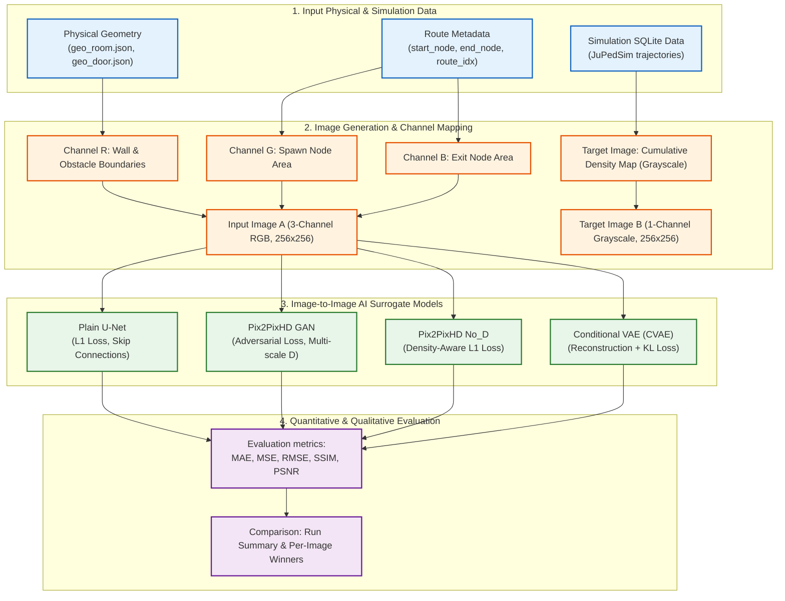

# Framework Design for Image-based AI Surrogate Model

กรอบแนวคิดนี้ถูกออกแบบมาเพื่ออธิบายขั้นตอนการทำงานร่วมกันของการดึงชุดข้อมูลเชิงภาพ (Image-to-Image translation) ในส่วนของ AI Surrogate Model เพื่อประเมินความหนาแน่นของผู้สัญจรในอาคาร 

แผนภูมิต่อไปนี้เขียนด้วยไวยากรณ์ Mermaid คุณสามารถนำไปใส่ในแอปพลิเคชันที่รองรับเพื่อแสดงผลเป็นแผนภาพเวิร์กโฟลว์ได้ทันที:

