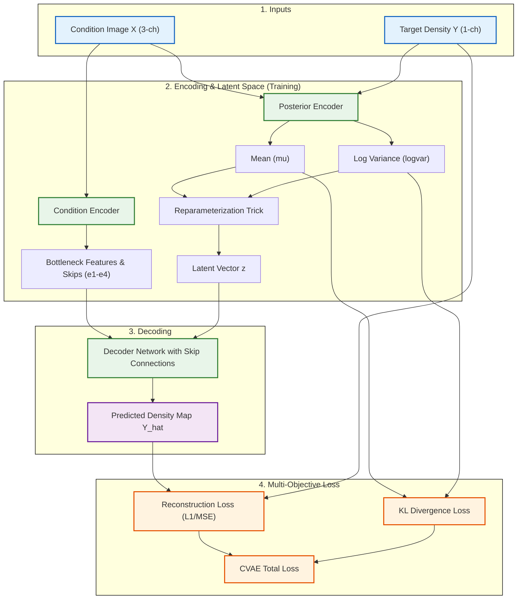

# รีวิว Code ของ Conditional Variational Autoencoder (CVAE)

จากการตรวจสอบโค้ดในส่วนของ `Method_CVAE` (`cvae_model.py`, `cvae_losses.py`, `cvae_density_train.py`, และ `cvae_density_test.py`) มีรายละเอียดการออกแบบและการทำงานดังนี้ครับ:

## 1. องค์ประกอบสถาปัตยกรรม (CVAE Architecture)
โมเดลประกอบด้วย 3 ส่วนการทำงานหลัก ได้แก่:
1. **Condition Encoder:** บีบอัดภาพเงื่อนไขทางกายภาพ $X$ (แปลน, จุดเกิด, เป้าหมาย) ออกมาเป็นโครงสร้างฟีเจอร์แชนเนลลึกหลายระดับ (`e1, e2, e3, e4` และ `bot`) 
2. **Posterior Encoder (ใช้เฉพาะตอน Train):** นำภาพอินพุต $X$ และภาพผลลัพธ์จริง $Y$ มาต่อกัน (Concatenate) รันผ่านโครงข่ายย่อเพื่อประเมินพารามิเตอร์ทางสถิติ ได้แก่ ค่าเฉลี่ย ($\mu$) และค่าล็อกความแปรปรวน ($\log \sigma^2$) ของตัวแปรสุ่มเพื่อสร้างเวกเตอร์แฝง (Latent vector $z$)
3. **Decoder:** นำฟีเจอร์กายภาพจาก Condition Encoder มาผนวกกับเวกเตอร์สุ่มแฝง $z$ (ที่สกัดมาจากพื้นที่เรียนรู้ หรือสุ่มสุ่มมาจากสถิติปกติมาตรฐาน $\mathcal{N}(0, I)$ ในรอบอนุมาน) จากนั้นนำมาขยายตัวแปรและใช้ Skip connections เพื่อสร้างภาพจำลองเอาต์พุต $\hat{Y}$

---

## 2. ฟังก์ชันความสูญเสียแบบคู่ขนาน (CVAE Loss Formulation)
ฟังก์ชันความสูญเสียใน `cvae_losses.py` ทำงานโดยปรับสมดุลระหว่างสองค่าหลัก:
* **Reconstruction Loss:** คำนวณความคลาดเคลื่อนระหว่างความหนาแน่นจริง $Y$ และค่าจำลอง $\hat{Y}$ ด้วย L1 Loss หรือ MSE Loss เพื่อให้พิกัดและเส้นทางการเดินของคนถูกต้องตรงจุดจริง
* **KL Divergence Loss:** คำนวณความเบี่ยงเบนระหว่างการแจกแจงแฝงที่ทำนายได้จากพาสทีเรียร์ $q(z|X, Y)$ เทียบกับการแจกแจงพรีออร์ $p(z) \sim \mathcal{N}(0, I)$ เพื่อดึงให้พื้นที่การสุ่มของโมเดลเป็นระเบียบ ทำให้สามารถสุ่มเวกเตอร์ใหม่จาก $\mathcal{N}(0, I)$ มารันทำนายตอนประเมินผลได้จริง

---

## 3. ข้อสังเกตและข้อเสนอแนะ (Pros & Cons)
- **จุดเด่น:** สามารถ **ทำนายรูปแบบความหลากหลาย (Multimodal Prediction)** ได้ กล่าวคือ หากระบบสุ่มเปลี่ยนตัวแปร $z$ แตกต่างกัน โมเดลจะสามารถทำนายเส้นทางเดินที่เป็นไปได้หลายแนวคิด (เช่น ผู้ใช้เลือกเดินอ้อมทางซ้าย หรือเลือกตัดตรงเข้าประตูทางขวา) สำหรับแปลนสถาปัตยกรรมเดียวกัน
- **จุดที่เป็นข้อจำกัด:** หากไม่มีการตั้งค่าน้ำหนัก KL Divergence ที่ดีพอ (ไม่มีการทำ KL Annealing) โมเดลอาจเสี่ยงต่อภาวะ **Posterior Collapse** (โมเดลเลือกละทิ้งข้อมูล $z$ แล้วใช้เพียงฟีเจอร์กายภาพ $X$ มาวาดพิกัดเดิมซ้ำ ๆ ส่งผลให้รูปภาพสูญเสียคุณสมบัติความหลากหลายในการทำนาย)

---

## ลำดับการทำงาน (CVAE Workflow)

---

## Model CVAE Structure

โมเดล CVAE มีความซับซ้อนกว่าภาพอื่นเนื่องจากประกอบด้วย 3 โครงข่ายย่อย ด้านล่างคือรายละเอียดการเปลี่ยนแปลงมิติข้อมูลของเลเยอร์ในแต่ละโครงข่ายเมื่อระบุค่าพารามิเตอร์ `base_filters = 64` (ค่าฐานบีบอัดเริ่มต้น), `latent_dim = 16`, และขนาดภาพ $256 \times 256$ พิกเซล:

### 1. ส่วนของ Condition Encoder Network
ทำหน้าที่บีบฟีเจอร์ข้อมูลกายภาพนำเข้า $X$ เพื่อเตรียมส่งต่อไปยัง Decoder (และเตรียม Skip connections สำหรับรักษารายละเอียดระดับพิกเซล):

| ชั้นประมวลผล (Block Name) | ข้อมูลนำเข้า (Input Shape) | รายละเอียดโครงสร้างเลเยอร์ (Operations) | มิติผลลัพธ์ (Output Shape) |
| :--- | :--- | :--- | :--- |
| **Input** | Condition Image A | - | ภาพ RGB ผังทางกายภาพ | `[B, 3, 256, 256]` |
| **DownBlock e1** | Input Image | Conv2D(3->64, stride=2) + BN + LeakyReLU(0.2) | `[B, 64, 128, 128]` |
| **DownBlock e2** | e1 output | Conv2D(64->128, stride=2) + BN + LeakyReLU(0.2) | `[B, 128, 64, 64]` |
| **DownBlock e3** | e2 output | Conv2D(128->256, stride=2) + BN + LeakyReLU(0.2) | `[B, 256, 32, 32]` |
| **DownBlock e4** | e3 output | Conv2D(256->512, stride=2) + BN + LeakyReLU(0.2) | `[B, 512, 16, 16]` |
| **Bottleneck Down** | e4 output | Conv2D(512->512, stride=2) + BN + LeakyReLU(0.2) | `[B, 512, 8, 8]` |

---

### 2. ส่วนของ Posterior Encoder Network (ใช้เฉพาะตอนรันเทรนโมเดล)
ทำหน้าที่ดึงเวกเตอร์สุ่มแฝง $z$ จากภาพเงื่อนไข $X$ และภาพผลลัพธ์เป้าหมาย $Y$ ที่ต่อรวมกัน (4 แชนเนล):

| ชั้นประมวลผล (Block / Layer Name) | ข้อมูลนำเข้า (Input Shape) | รายละเอียดการประมวลผล (Operations) | มิติผลลัพธ์ (Output Shape) |
| :--- | :--- | :--- | :--- |
| **Input** | Concatenated A & B | ภาพผัง (3-ch) ต่อแชนเนลกับความหนาแน่นเป้าหมาย (1-ch) | `[B, 4, 256, 256]` |
| **DownBlock Nets** | Concatenated Input | รันผ่าน Downsampling layers 5 ชั้น ย่อขนาดเชิงพื้นที่เหลือ $8 \times 8$ | `[B, 512, 8, 8]` |
| **Pooling & Flatten** | Down output | AdaptiveAvgPool2d(1) -> Flatten มิติเชิงลึก | `[B, 512]` |
| **Linear Layer (mu)** | Flattened output | Linear(512 -> latent_dim) | `[B, 16]` |
| **Linear Layer (logvar)** | Flattened output | Linear(512 -> latent_dim) | `[B, 16]` |

---

### 3. ส่วนของ Decoder Network
ทำหน้าที่ฟื้นฟูมิติภาพเพื่อสร้างทำนายผลลัพธ์ $\hat{Y}$ โดยผสมฟีเจอร์กายภาพ $X$ เข้ากับตัวแปรแฝง $z$:

| ขั้นตอนคำนวณ (Operation Name) | ข้อมูลนำเข้า (Input Shape) | รายละเอียดการดำเนินการ (Operations) | มิติผลลัพธ์ (Output Shape) |
| :--- | :--- | :--- | :--- |
| **Latent Projection** | Latent vector $z$ (`[B, 16]`) | Linear(16 -> 8*8*256) -> View reshape | `[B, 256, 8, 8]` |
| **Mid Concatenate** | Bottleneck + Latent | ต่อแชนเนลของ Bottleneck (`[B, 512, 8, 8]`) กับ $z$ | `[B, 768, 8, 8]` |
| **UpBlock u4** | Concatenated mid | Upsample + Conv2D(768->512) -> BN -> ReLU | `[B, 512, 16, 16]` |
| **UpBlock u3** | u4 output + Skip `e4` | Concatenate(u4, e4) (`[B, 1024, 16, 16]`) -> Conv2D(1024->256) | `[B, 256, 32, 32]` |
| **UpBlock u2** | u3 output + Skip `e3` | Concatenate(u3, e3) (`[B, 512, 32, 32]`) -> Conv2D(512->128) | `[B, 128, 64, 64]` |
| **UpBlock u1** | u2 output + Skip `e2` | Concatenate(u2, e2) (`[B, 256, 64, 64]`) -> Conv2D(256->64) | `[B, 64, 128, 128]` |
| **UpBlock u0** | u1 output + Skip `e1` | Concatenate(u1, e1) (`[B, 128, 128, 128]`) -> Conv2D(128->32) | `[B, 32, 256, 256]` |
| **Output Conv** | u0 output | Conv2D(32->1, kernel=3, padding=1) | `[B, 1, 256, 256]` |

