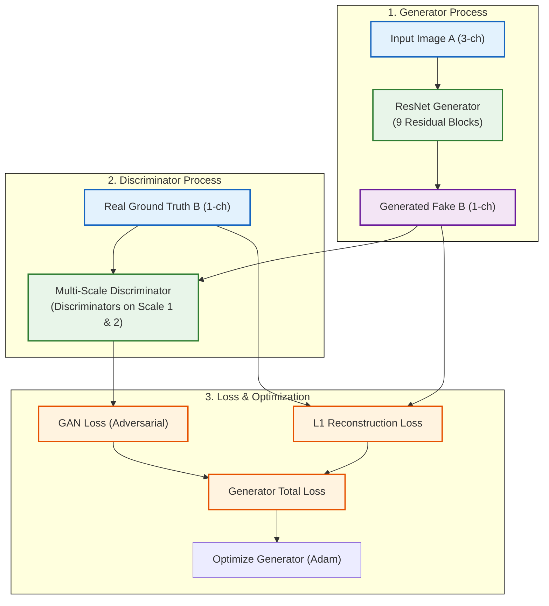

# รีวิว Code ของ Pix2PixHD

จากการตรวจสอบโค้ดในส่วนของ `Method_pix2pixHD` (`train_pix2pixHD_densitymap_bw.py` และ `test_pix2pixHD_densitymap_bw.py`) มีรายละเอียดการออกแบบและการทำงานดังนี้ครับ:

## 1. ส่วนของเครื่องกำเนิดภาพ (Generator Network)
- สถาปัตยกรรมใช้สถาปัตยกรรมกลุ่ม **ResNet-based Generator**:
  - **Downsampling:** ใช้ Convolutional layers ร่วมกับ Instance Normalization และ ReLU ทำการย่อภาพและขยายแชนเนลฟีเจอร์เป็น `64 -> 128 -> 256 -> 512`
  - **Residual Core:** โค้ดรันข้อมูลผ่านกลุ่มบล็อก `ResNetBlock` ซ้อนกันจำนวน **9 บล็อก** ซึ่งใช้การข้ามความเชื่องโยงแบบ $x + f(x)$ ป้องกันการหายไปของเกรเดียนต์และช่วยรักษาความเสถียรของฟีเจอร์ระดับลึก
  - **Upsampling:** ขยายมิติภาพกลับเป็น 256x256 ผ่าน `ConvTranspose2d` และปิดท้ายเอาต์พุตด้วยฟังก์ชัน `Tanh` เพื่อปรับค่าสีของพิกเซลให้อยู่ในช่วง $[-1, 1]$

---

## 2. ส่วนของเครื่องแยกแยะภาพแบบหลายสเกล (Multi-scale Discriminator Network)
- โค้ดใช้แนวคิดของ **Multi-scale Discriminator** ร่วมกับ **PatchGAN**:
  - **SingleDiscriminator:** เป็นตัวทำนายจำแนกจุดพิกัดท้องถิ่น (Patch) ขนาด 6 ชั้นลึก โดดเด่นด้วยการใช้ Instance Normalization (เพื่อให้รองรับการประยุกต์ใช้กับเกณฑ์ WGAN-GP) 
  - **DiscriminatorNetwork:** รวบรวม SingleDiscriminator ทำงานร่วมกันบนสเกลภาพที่แตกต่างกัน (เช่น ภาพขนาดจริง และภาพที่ถูกย่อเฉลี่ยลงครึ่งหนึ่งผ่าน `AvgPool2d`) ทำให้โมเดลรับรู้และจำแนกรายละเอียดความสมจริงของทิศทางสัญจรได้ทั้งในระดับโครงสร้างพื้นที่ขนาดใหญ่ (Global) และจุดเชื่อมขอบประตูขนาดเล็ก (Local)

---

## 3. เกณฑ์การประเมินและการฝึกฝน (Loss & Training Strategy)
- โค้ดรองรับการทำงานของ **WGAN-GP (Wasserstein GAN with Gradient Penalty)** ร่วมกับฟังก์ชัน `compute_gradient_penalty`
- การผสมผสานของค่า Loss:
  - **Adversarial Loss:** เพื่อกระตุ้นให้ภาพความหนาแน่นส้นทางสัญจรมีความสมจริง คมชัด
  - **L1 / Reconstruction Loss:** เพื่อควบคุมไม่ให้ทิศทางสัญจรสลับขวาซ้ายหรือออกห่างจากทิศทางจริงในภาพ Target

---

## 4. ข้อสังเกตและข้อเสนอแนะ (Pros & Cons)
- **จุดเด่น:** สามารถสร้างแผนภูมิความหนาแน่นที่คมชัดอย่างยิ่ง มีรูปร่างโค้งมนสอดคล้องกับพฤติกรรมการเคลื่อนที่ของมนุษย์จริง ไม่เกิดความพร่ามัว ทำให้ได้ค่า MAE ต่ำที่สุด
- **จุดที่เป็นข้อจำกัด:** การฝึกฝนโมเดลประเภท GAN มีความอ่อนไหวสูงต่อความเสถียร ต้องมีการจูนระดับสัดส่วนน้ำหนัก Loss ระหว่างฝั่ง Generator และ Discriminator อย่างพอดี เพื่อไม่ให้เกิดภาวะ Mode Collapse

---

## ลำดับการทำงาน (Pix2PixHD Workflow)

---

## Model Pix2PixHD Structure

ด้านล่างคือรายละเอียดการออกแบบและจัดแจงลำดับของเลเยอร์ในโมเดล Pix2PixHD ทั้งในส่วนเครื่องกำเนิด (Generator) และเครื่องแยกแยะ (Discriminator) เมื่อกำหนดมิติภาพนำเข้าขนาด $256 \times 256$ พิกเซล:

### 1. โครงสร้างภายในของ Generator Network (ResNet-based Generator)

| ส่วนของเครือข่าย (Section) | เลเยอร์ / บล็อก (Layer Name) | มิติข้อมูลนำเข้า (Input Shape) | รายละเอียดการคำนวณ (Operations) | มิติผลลัพธ์ (Output Shape) |
| :--- | :--- | :--- | :--- | :--- |
| **Input** | Image Input A | - | ภาพ RGB ผังอาคารและเงื่อนไขจำลอง | `[B, 3, 256, 256]` |
| **Front-End Padding** | ReflectionPad2d | `[B, 3, 256, 256]` | สะท้อนพิกเซลขอบภาพเพิ่มรอบด้าน 3 พิกเซล | `[B, 3, 262, 262]` |
| **Front-End Conv** | Conv1 + IN + ReLU | `[B, 3, 262, 262]` | Conv2D(3->64, kernel=7, stride=1) -> InstanceNorm -> ReLU | `[B, 64, 256, 256]` |
| **Downsampling 1** | Conv2 + IN + ReLU | `[B, 64, 256, 256]` | Conv2D(64->128, kernel=3, stride=2, padding=1) -> IN -> ReLU | `[B, 128, 128, 128]` |
| **Downsampling 2** | Conv3 + IN + ReLU | `[B, 128, 128, 128]` | Conv2D(128->256, kernel=3, stride=2, padding=1) -> IN -> ReLU | `[B, 256, 64, 64]` |
| **Downsampling 3** | Conv4 + IN + ReLU | `[B, 256, 64, 64]` | Conv2D(256->512, kernel=3, stride=2, padding=1) -> IN -> ReLU | `[B, 512, 32, 32]` |
| **Residual Core** | `ResNetBlock` $\times$ 9 | `[B, 512, 32, 32]` | รันผ่านบล็อกข้ามสาย 9 บล็อกซ้อนกัน: $x + \text{Conv(Conv(x))}$ ด้วย InstanceNorm | `[B, 512, 32, 32]` |
| **Upsampling 1** | ConvTranspose1 + IN + ReLU | `[B, 512, 32, 32]` | ConvTranspose2D(512->256, kernel=3, stride=2, output_padding=1) -> IN -> ReLU | `[B, 256, 64, 64]` |
| **Upsampling 2** | ConvTranspose2 + IN + ReLU | `[B, 256, 64, 64]` | ConvTranspose2D(256->128, kernel=3, stride=2, output_padding=1) -> IN -> ReLU | `[B, 128, 128, 128]` |
| **Upsampling 3** | ConvTranspose3 + IN + ReLU | `[B, 128, 128, 128]` | ConvTranspose2D(128->64, kernel=3, stride=2, output_padding=1) -> IN -> ReLU | `[B, 64, 256, 256]` |
| **Output Padding** | ReflectionPad2d | `[B, 64, 256, 256]` | สะท้อนพิกเซลขอบภาพเพิ่มรอบด้าน 3 พิกเซล | `[B, 64, 262, 262]` |
| **Output Conv** | ConvOut + Tanh | `[B, 64, 262, 262]` | Conv2D(64->out_channels, kernel=7, stride=1) -> Tanh | `[B, out_channels, 256, 256]` |

---

### 2. โครงสร้างภายในของ Single Discriminator (PatchGAN)
ในสถาปัตยกรรมแบบ Multi-scale จะมี Discriminator โครงสร้างลักษณะนี้ทำงานร่วมกันหลายระดับขนาด โดยใช้ข้อมูลนำเข้าที่เป็นภาพต่อกัน (Concatenate) ระหว่างภาพ Input และภาพ Target/Prediction (รวมเป็น 4 หรือ 6 แชนเนล):

| ชั้นประมวลผล (Layer Name) | มิติข้อมูลนำเข้า (Input Shape) | รายละเอียดการคำนวณ (Operations) | มิติผลลัพธ์ (Output Shape) |
| :--- | :--- | :--- | :--- |
| **Layer 1** | Concatenated Input | `[B, in_channels, 256, 256]` | Conv2D(in_channels->64, kernel=4, stride=2, padding=1) -> LeakyReLU(0.2) | `[B, 64, 128, 128]` |
| **Layer 2** | Layer 1 Features | `[B, 64, 128, 128]` | Conv2D(64->128, kernel=4, stride=2, padding=1) -> InstanceNorm -> LeakyReLU(0.2) | `[B, 128, 64, 64]` |
| **Layer 3** | Layer 2 Features | `[B, 128, 64, 64]` | Conv2D(128->256, kernel=4, stride=2, padding=1) -> InstanceNorm -> LeakyReLU(0.2) | `[B, 256, 32, 32]` |
| **Layer 4** | Layer 3 Features | `[B, 256, 32, 32]` | Conv2D(256->512, kernel=4, stride=1, padding=1) -> InstanceNorm -> LeakyReLU(0.2) | `[B, 512, 31, 31]` |
| **Layer 5 (Output)** | Layer 4 Features | `[B, 512, 31, 31]` | Conv2D(512->1, kernel=4, stride=1, padding=1) | `[B, 1, 30, 30]` |

