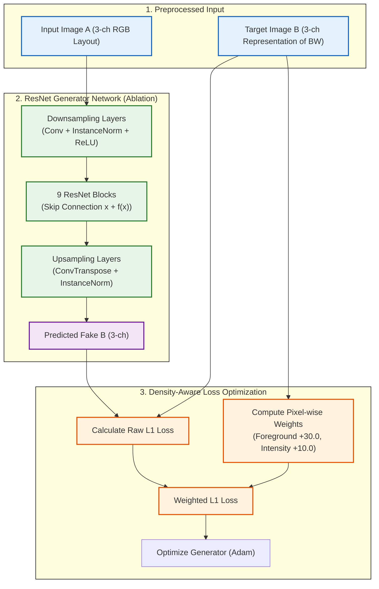

# รีวิว Code ของ Pix2PixHD (Without Adversarial / No_D)

จากการตรวจสอบโค้ดในส่วนของ `Method_pix2pixhd_No_D` (`train_pix2pixhd_NoD_densitymap_bw.py` และ `test_pix2pixhd_NoD_densitymap_bw.py`) มีรายละเอียดการออกแบบและการทำงานดังนี้ครับ:

## 1. แนวคิดหลักและการทำงาน (Core Idea)
- โมเดลนี้ถูกใช้เป็น **Ablation Study (การทดลองแยกส่วนเพื่อพิสูจน์ผล)** เพื่อทดสอบประสิทธิภาพของโครงข่ายตัวประมวลผลฝั่ง Generator ของ Pix2PixHD (ResNet Generator) โดย **ปิดการทำงานของ Discriminator (ตัวจำแนกภาพแบบตรงข้าม) ออกไป 100%**
- โมเดลนี้เรียนรู้ในลักษณะ Supervised Learning แท้ ๆ โดยไม่มีฟังก์ชันของ Adversarial (GAN) มาช่วย ซึ่งป้องกันปัญหาของ GAN-induced hallucinations (ภาพจำลองจุดเลอะเทอะแปลก ๆ ที่ GAN วาดขึ้นมาเพื่อหลอกตัวจับผิด)

---

## 2. ฟังก์ชันความสูญเสียแบบคำนึงถึงความหนาแน่น (Density-Aware L1 Reconstruction Loss)
เนื่องจากไม่มี Discriminator มาช่วยดึงขอบภาพ โค้ดจึงแก้ปัญหาเรื่องความเบาบางของพิกเซลจำลองสัญจร (Pedestrian density มักเป็นสีดำเสียส่วนใหญ่) ด้วยการใช้ **Density-Aware L1 Loss**:
- แทนที่จะคำนวณ L1 Loss ทั่วไป โค้ดได้ทำการ **คำนวณน้ำหนักพิกเซล (Pixel-wise Weights) บนภาพ Target** ก่อนคูณเข้ากับค่า L1 Loss:
  - **Foreground Weight:** พิกเซลใดที่เป็นพื้นที่ทางเดินคน (ไม่ใช่พื้นหลังสีดำ) จะได้รับค่าน้ำหนักบวกเพิ่มขึ้นเป็นพิเศษ (ดีฟอลต์: +30.0)
  - **Intensity Weight:** พิกเซลใดที่มีค่าความหนาแน่นสว่างมาก จะถูกถ่วงน้ำหนักคูณเพิ่มตามความสว่าง (ดีฟอลต์: ค่าสีเทา $\times$ 10.0)
- เทคนิคการถ่วงน้ำหนักนี้ ป้องกันไม่ให้ Generator เลือกตัวช่วยลัด (Shortcut) ด้วยการทำนายผลลัพธ์เป็น "สีดำล้วน" (ไม่มีคนเดินเลย) ซึ่งเป็นวิธีที่ลด L1 Loss ได้ง่ายที่สุดในทางคณิตศาสตร์

---

## 3. ข้อสังเกตและข้อเสนอแนะ (Pros & Cons)
- **จุดเด่น:** 
  - การเทรนมีความเสถียรสูงมาก (Stable training) ไม่มีปัญหาเรื่อง Mode Collapse หรือเกรเดียนต์หายเหมือน GAN ทั่วไป 
  - ทำงานรวดเร็วในขั้นตอนประมวลผล (Inference) และทำนายจุดกระเจิงของสีเทาได้เนียนตา
- **จุดที่เป็นข้อจำกัด:** 
  - ขอบของเส้นทางและจุดคอขวดจะมีความฟุ้งและเบลอ (Blurry edges) คล้ายคลึงกับ Plain U-Net เนื่องจากขาด Adversarial loss มาช่วยดึงรายละเอียดขอบความคมชัดสูง (High-frequency details)

---

## ลำดับการทำงาน (Pix2PixHD No_D Workflow)

---

## Model Pix2PixHD No_D Structure

ตารางด้านล่างแสดงการไหลของข้อมูลและการเปลี่ยนแปลงมิติของเทนเซอร์ (Tensor Shape) ในตัวประมวลผลเครื่องกำเนิด (Generator) ของ Pix2PixHD No_D โดยในการตั้งค่านี้ **จะไม่มีเครือข่าย Discriminator** เพื่อจำแนกความสมจริง มีเพียงโครงข่าย Generator ที่รันการทำนายพิกเซลโดยตรงดังนี้:

### 1. โครงสร้างภายในของ Generator Network (ResNet-based Generator)

| ส่วนของเครือข่าย (Section) | เลเยอร์ / บล็อก (Layer Name) | มิติข้อมูลนำเข้า (Input Shape) | รายละเอียดการคำนวณ (Operations) | มิติผลลัพธ์ (Output Shape) |
| :--- | :--- | :--- | :--- | :--- |
| **Input** | Image Input A | - | ภาพ RGB ผังอาคารและเงื่อนไขจำลอง | `[B, 3, 256, 256]` |
| **Front-End Padding** | ReflectionPad2d | `[B, 3, 256, 256]` | สะท้อนพิกเซลขอบภาพเพิ่มรอบด้าน 3 พิกเซล | `[B, 3, 262, 262]` |
| **Front-End Conv** | Conv1 + IN + ReLU | `[B, 3, 262, 262]` | Conv2D(3->64, kernel=7, stride=1) -> InstanceNorm -> ReLU | `[B, 64, 256, 256]` |
| **Downsampling 1** | Conv2 + IN + ReLU | `[B, 64, 256, 256]` | Conv2D(64->128, kernel=3, stride=2, padding=1) -> IN -> ReLU | `[B, 128, 128, 128]` |
| **Downsampling 2** | Conv3 + IN + ReLU | `[B, 128, 128, 128]` | Conv2D(128->256, kernel=3, stride=2, padding=1) -> IN -> ReLU | `[B, 256, 64, 64]` |
| **Downsampling 3** | Conv4 + IN + ReLU | `[B, 256, 64, 64]` | Conv2D(256->512, kernel=3, stride=2, padding=1) -> IN -> ReLU | `[B, 512, 32, 32]` |
| **Residual Core** | `ResNetBlock` $\times$ 9 | `[B, 512, 32, 32]` | รันผ่านบล็อกข้ามสาย 9 บล็อกซ้อนกัน: $x + \text{Conv(Conv(x))}$ ด้วย InstanceNorm | `[B, 512, 32, 32]` |
| **Upsampling 1** | ConvTranspose1 + IN + ReLU | `[B, 512, 32, 32]` | ConvTranspose2D(512->256, kernel=3, stride=2, output_padding=1) -> IN -> ReLU | `[B, 256, 64, 64]` |
| **Upsampling 2** | ConvTranspose2 + IN + ReLU | `[B, 256, 64, 64]` | ConvTranspose2D(256->128, kernel=3, stride=2, output_padding=1) -> IN -> ReLU | `[B, 128, 128, 128]` |
| **Upsampling 3** | ConvTranspose3 + IN + ReLU | `[B, 128, 128, 128]` | ConvTranspose2D(128->64, kernel=3, stride=2, output_padding=1) -> IN -> ReLU | `[B, 64, 256, 256]` |
| **Output Padding** | ReflectionPad2d | `[B, 64, 256, 256]` | สะท้อนพิกเซลขอบภาพเพิ่มรอบด้าน 3 พิกเซล | `[B, 64, 262, 262]` |
| **Output Conv** | ConvOut + Tanh | `[B, 64, 262, 262]` | Conv2D(64->out_channels, kernel=7, stride=1) -> Tanh | `[B, out_channels, 256, 256]` |

> [!NOTE]
> ในโครงสร้างแบบ No_D นี้ จะไม่มีตัวแบบ Discriminator ทำงานคู่กัน (ต่างจาก Pix2PixHD ปกติ) ค่าพารามิเตอร์ของ Generator ทั้งหมดจะถูกปรับปรุงโดยใช้เพียงผลลัพธ์ของ **Weighted L1 loss** (Density-Aware L1 Loss) ที่เปรียบเทียบกับภาพจริงเท่านั้นทำความเสถียรในการฝึกฝนเพิ่มขึ้นอย่างยิ่ง

