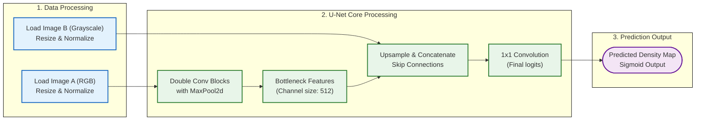

# รีวิว Code ของ Plain U-Net

จากการตรวจสอบโค้ดในส่วนของ `Method_PlainUnet` (`plainunet_common.py`, `train_PlainUnet_densitymap.py`, และ `test_PlainUnet_densitymap.py`) มีรายละเอียดการออกแบบและการทำงานดังนี้ครับ:

## 1. การเตรียมข้อมูล (Dataset & Image Preprocessing)
- **Input Representation (ภาพอินพุต 3 แชนเนล):** โค้ดเตรียมภาพคู่ขนานจากโฟลเดอร์ `A` ด้วยขนาดพิกเซลคงที่ (ปรับขนาดภาพด้วย Bilinear interpolation) 
  - ขนาดดีฟอลต์: 256x256 พิกเซล
  - การปรับสเกลค่าสี: หารด้วย 255.0 เพื่อเปลี่ยนช่วงข้อมูลให้อยู่ในย่าน $[0, 1]$
- **Target Representation (ภาพเอาต์พุต 1 แชนเนล):** โค้ดเตรียมภาพความหนาแน่นผู้ใช้งานจากโฟลเดอร์ `B` โดยเปิดขึ้นมาในฐานะภาพ Grayscale (1 แชนเนล) และปรับย่านข้อมูลเป็น $[0, 1]$

---

## 2. โครงสร้างโมเดล (Plain U-Net Architecture)
- สถาปัตยกรรมเป็นไปตามรูปแบบของโครงข่ายคอนโวลูชันแบบรูปตัวยู (U-Net) ดั้งเดิม:
  - **Encoder (ฝั่งลง):** ใช้ `ConvBlock` (ประกอบด้วย Conv2D สองชั้นลึกคู่กับ BatchNorm และ ReLU) เพื่อลดมิติเชิงพื้นที่ผ่าน `MaxPool2d(2)` พร้อมทวีคูณจำนวนฟิลเตอร์แชนเนลเริ่มจาก `32 -> 64 -> 128 -> 256 -> 512`
  - **Decoder (ฝั่งขึ้น):** ทำงานโดยขยายภาพย้อนกลับด้วย `Upsample(scale_factor=2)` แบบ Nearest neighbor และนำฟีเจอร์ฝั่งขาขึ้นมาเชื่อมต่อ (Concatenate) เข้ากับฟีเจอร์ระดับเดียวกันของฝั่งลง (Skip Connection) ผ่านการเรียงต่อกันในมิติแชนเนล เพื่อไม่ให้ข้อมูลพิกเซลขอบเขตกำแพงและประตูสูญหายระหว่างบีบอัด
  - **Output layer:** ใช้การทำ Convolution ขนาด 1x1 เพื่อบีบฟีเจอร์แชนเนลลงมาเหลือ 1 ช่อง (ความหนาแน่น)

---

## 3. ข้อสังเกตและข้อเสนอแนะ (Pros & Cons)
- **จุดเด่น:** การเชื่อมต่อข้ามฝั่ง (Skip Connections) ช่วยให้ U-Net จดจำตำแหน่งเชิงตำแหน่งของผนังและเป้าหมายได้แม่นยำมาก ทำให้เส้นทางสัญจรที่ทำนายออกมาสอดคล้องกับพิกัดกายภาพของตึก ไม่ทะลุกำแพง
- **จุดที่เป็นข้อจำกัด:** การใช้เพียง **L1 Loss** หรือ **MSE Loss** ในการเทรนเพียงอย่างเดียว ทำให้โมเดลเรียนรู้การเฉลี่ยค่าผลลัพธ์ (Regression to the mean) ส่งผลให้เส้นทางจำลองดูฟุ้งหรือมีลักษณะเบลอ (Blurry) ความเข้มพิกเซลถูกเกลี่ยจนเรียบเกินไป ไม่คมชัดเท่าผลลัพธ์จำลองจริง

---

## ลำดับการทำงาน (Plain U-Net Workflow)

---

## Model Plain U-Net Structure

ตารางด้านล่างแสดงการไหลของข้อมูลและการเปลี่ยนแปลงมิติภาพ (Tensor Shape) ในแต่ละเลเยอร์ของโมเดล Plain U-Net เมื่อกำหนดภาพนำเข้าขนาด $256 \times 256$ พิกเซล และฟิลเตอร์เริ่มต้น `base = 32`:

| ขั้นตอน (Step) | เลเยอร์ / บล็อก (Layer / Block) | ข้อมูลนำเข้า (Input Shape) | การประมวลผลภายใน (Operations) | ผลลัพธ์ (Output Shape) | ความเชื่อมโยง (Skip Connection) |
| :--- | :--- | :--- | :--- | :--- | :--- |
| **Input** | Image Input | - | ตัวแปรภาพ RGB (3 แชนเนล) | `[B, 3, 256, 256]` | - |
| **Encoder 1** | `ConvBlock (c1)` | `[B, 3, 256, 256]` | Conv2D(3->32) + BN + ReLU -> Conv2D(32->32) + BN + ReLU | `[B, 32, 256, 256]` | บันทึกเก็บไว้เพื่อเชื่อมต่อกับ `u1` |
| **Down 1** | MaxPool2d | `[B, 32, 256, 256]` | ย่อขนาดมิติภาพด้วยการทำ Pool 2x2 | `[B, 32, 128, 128]` | - |
| **Encoder 2** | `ConvBlock (c2)` | `[B, 32, 128, 128]` | Conv2D(32->64) + BN + ReLU -> Conv2D(64->64) + BN + ReLU | `[B, 64, 128, 128]` | บันทึกเก็บไว้เพื่อเชื่อมต่อกับ `u2` |
| **Down 2** | MaxPool2d | `[B, 64, 128, 128]` | ย่อขนาดมิติภาพด้วยการทำ Pool 2x2 | `[B, 64, 64, 64]` | - |
| **Encoder 3** | `ConvBlock (c3)` | `[B, 64, 64, 64]` | Conv2D(64->128) + BN + ReLU -> Conv2D(128->128) + BN + ReLU | `[B, 128, 64, 64]` | บันทึกเก็บไว้เพื่อเชื่อมต่อกับ `u3` |
| **Down 3** | MaxPool2d | `[B, 128, 64, 64]` | ย่อขนาดมิติภาพด้วยการทำ Pool 2x2 | `[B, 128, 32, 32]` | - |
| **Encoder 4** | `ConvBlock (c4)` | `[B, 128, 32, 32]` | Conv2D(128->256) + BN + ReLU -> Conv2D(256->256) + BN + ReLU | `[B, 256, 32, 32]` | บันทึกเก็บไว้เพื่อเชื่อมต่อกับ `u4` |
| **Down 4** | MaxPool2d | `[B, 256, 32, 32]` | ย่อขนาดมิติภาพด้วยการทำ Pool 2x2 | `[B, 256, 16, 16]` | - |
| **Bottleneck** | `ConvBlock (bn)` | `[B, 256, 16, 16]` | Conv2D(256->512) + BN + ReLU -> Conv2D(512->512) + BN + ReLU | `[B, 512, 16, 16]` | เลเยอร์จุดกึ่งกลางที่มิติต่ำที่สุด |
| **Decoder 4** | `ConvBlock (u4)` | `[B, 768, 32, 32]` | Upsample(bn) + Concatenate(c4) -> ConvBlock(768->256) | `[B, 256, 32, 32]` | เชื่อมต่อ `[B, 512, 32, 32]` และ `[B, 256, 32, 32]` |
| **Decoder 3** | `ConvBlock (u3)` | `[B, 384, 64, 64]` | Upsample(u4) + Concatenate(c3) -> ConvBlock(384->128) | `[B, 128, 64, 64]` | เชื่อมต่อ `[B, 256, 64, 64]` และ `[B, 128, 64, 64]` |
| **Decoder 2** | `ConvBlock (u2)` | `[B, 192, 128, 128]` | Upsample(u3) + Concatenate(c2) -> ConvBlock(192->64) | `[B, 64, 128, 128]` | เชื่อมต่อ `[B, 128, 128, 128]` และ `[B, 64, 128, 128]` |
| **Decoder 1** | `ConvBlock (u1)` | `[B, 96, 256, 256]` | Upsample(u2) + Concatenate(c1) -> ConvBlock(96->32) | `[B, 32, 256, 256]` | เชื่อมต่อ `[B, 64, 256, 256]` และ `[B, 32, 256, 256]` |
| **Output** | `Conv2d (out)` | `[B, 32, 256, 256]` | Conv2D(32->1) kernel_size=1 (Sigmoid จะถูกคูณภายหลังเพื่อบีบช่วง) | `[B, 1, 256, 256]` | แปลงเอาต์พุตให้ออกมาเป็นค่าระดับพิกเซลความหนาแน่น |

