# รีวิว Code ของ Graph Neural Network (GNN)

จากการตรวจสอบโค้ดในส่วนของ `Method_GNN` (`model.py` และ `dataset_gnn.py`) มีรายละเอียดการออกแบบและการทำงานดังนี้ครับ:

## 1. การเตรียมข้อมูล (Graph Representation)
- **โครงสร้างกราฟ (Adjacency Matrix):** โค้ดดึงข้อมูลโครงสร้างแปลนจาก `topological_graph.json` มาสร้างเป็น Adjacency Matrix และทำ Symmetric Normalization ด้วยสูตร $D^{-0.5} A D^{-0.5}$ (อ้างอิงจากหลักการแพร่กระจายข้อมูลของ Graph Convolutional Network (GCN) เสนอโดย Kipf & Welling, 2017 ดูรายละเอียดแหล่งอ้างอิงท้ายไฟล์) เพื่อป้องกันปัญหาค่าระเบิด (Gradient Explosion) และควบคุมขอบเขตข้อมูลของห้องทั้งหมดให้สอดคล้องกัน ช่วยให้การเทรนเสถียรขึ้น
- **ฟีเจอร์ระดับ Node (Node Features):** มีการผสมผสานฟีเจอร์ 2 ส่วนเข้าด้วยกันบนแต่ละ Node:
  - **Static Features:** ขนาดพื้นที่ (`area`) และประเภทห้อง (`is_corridor`) 
  - **Dynamic Route Features:** มีการใส่ข้อมูลของสถานการณ์นั้นๆ ลงไปในแต่ละ Node ได้แก่ การระบุจุดเริ่มต้น (`IsStart`), จุดหมาย (`IsEnd`), จำนวนคน (`Agents`), ระยะทาง (`DistStraight`, `DistTopo`), และฟีเจอร์เกี่ยวกับคอขวด (`min_door_w`, `door_count`, `bottleneck_score`)

## 2. โครงสร้างโมเดล (GNN Architecture)
- โมเดลใช้โครงสร้างของ Graph Convolutional Network (GCN) แบบเรียบง่ายผ่าน `GCNLayer`
- ซ้อน Layer ตามการตั้งค่า (เช่น `[64, 32]`) พร้อมกับใช้ `ReLU` activation function และ `Dropout` เพื่อป้องกัน Overfitting
- **Global Pooling:** โค้ดใช้วิธี **Global Mean Pooling** (`torch.mean(x, dim=1)`) ในการยุบข้อมูลฟีเจอร์ของทุก Node ให้กลายเป็น Vector เดียวของทั้งกราฟ ก่อนส่งเข้า `Linear Predictor` เพื่อทำนายค่าเป้าหมาย (Travel Time)

## 3. ข้อสังเกตและข้อเสนอแนะ (Pros & Cons)
- **จุดเด่น:** วิธีการนำ Dynamic Route Features ไปผนวกรวมกับ Node Features (เอาข้อมูลสถานการณ์ไปใส่ไว้ตามห้องต่างๆ) ถือว่าชาญฉลาดมาก เพราะช่วยให้โมเดล GNN รับรู้ได้ว่า "การสัญจรเกิดจากไหนไปไหน และมีอุปสรรคคอขวดใดบ้างบนโหนดนั้นๆ" ท่ามกลางโครงสร้างของแปลนอาคาร
- **จุดที่อาจทำให้ผลลัพธ์คลาดเคลื่อน (สู้ MLP ไม่ได้):** การใช้ **Global Mean Pooling** ในขั้นตอนสุดท้ายทำให้อาจสูญเสียข้อมูลความต่อเนื่องของเส้นทาง (Path structure) ไปทั้งหมด เพราะมันคือการเอาค่าของทุก Node ในกราฟมาหาค่าเฉลี่ย หากเปลี่ยนไปใช้กลไกแบบ Graph Attention Network (GAT) หรือการทำ Pooling แบบเจาะจงเฉพาะ Node ที่อยู่บนเส้นทางที่เดินผ่าน น่าจะช่วยให้โมเดลทำนายได้แม่นยำขึ้นมากครับ

---

## ลำดับการทำงาน (GNN Workflow)

```mermaid
graph TD
    %% Styling
    classDef data fill:#e3f2fd,stroke:#1565c0,stroke-width:2px;
    classDef extract fill:#fff3e0,stroke:#e65100,stroke-width:2px;
    classDef gnn fill:#e8f5e9,stroke:#2e7d32,stroke-width:2px;
    classDef output fill:#f3e5f5,stroke:#6a1b9a,stroke-width:2px;

    %% Data Loading
    subgraph Dataset_Preparation ["1. Dataset Preparation (dataset_gnn.py)"]
        A[Load topological_graph.json] --> B[Create Normalized Adjacency Matrix]
        A --> C[Extract Static Features:<br/>Area, Is_Corridor]
        D[Load Scenario Data] --> E[Extract Dynamic Features:<br/>IsStart, IsEnd, Agents,<br/>Distance, Bottleneck factors]
        C --> F[Concat Node Features]
        E --> F
    end
    class A,D data;
    class B,C,E,F extract;

    %% Model Processing
    subgraph Model_Architecture ["2. Model Processing (model.py)"]
        B --> G[GCN Layer 1 + ReLU + Dropout]
        F --> G
        G --> H[GCN Layer 2 + ReLU + Dropout]
        H --> I[Global Mean Pooling<br/>Aggregate all node embeddings]
        I --> J[Linear Predictor Network]
    end
    class G,H,I,J gnn;

    %% Prediction
    subgraph Output_Prediction ["3. Output Prediction"]
        J --> K([Predicted Travel Time])
    end
    class K output;
```



``` Mermaid 2
---
config:
  layout: dagre
---
flowchart LR
 subgraph Dataset_Preparation["1. Dataset Preparation"]
        B["Create Normalized Adjacency Matrix"]
        A["Load topological_graph.json"]
        C["Extract Static Features:<br>Area, Is_Corridor"]
        E["Extract Dynamic Features:<br>IsStart, IsEnd, Agents,<br>Distance, Bottleneck factors"]
        D["Load Scenario Data"]
        F["Concat Node Features"]
  end
 subgraph Model_Architecture["2. Model Processing"]
        G["GCN Layer 1 + ReLU + Dropout"]
        H["GCN Layer 2 + ReLU + Dropout"]
        I["Global Mean Pooling<br>Aggregate all node embeddings"]
        J["Linear Predictor Network"]
  end
 subgraph Output_Prediction["3. Output Prediction"]
        K(["Predicted Travel Time"])
  end
    A --> B & C
    D --> E
    C --> F
    E --> F
    B --> G
    F --> G
    G --> H
    H --> I
    I --> J
    J --> K

     B:::extract
     A:::data
     C:::extract
     E:::extract
     D:::data
     F:::extract
     G:::gnn
     H:::gnn
     I:::gnn
     J:::gnn
     K:::output
    classDef data fill:#e3f2fd,stroke:#1565c0,stroke-width:2px
    classDef extract fill:#fff3e0,stroke:#e65100,stroke-width:2px
    classDef gnn fill:#e8f5e9,stroke:#2e7d32,stroke-width:2px
    classDef output fill:#f3e5f5,stroke:#6a1b9a,stroke-width:2px
    style Output_Prediction stroke:#000000
    style Model_Architecture stroke:#000000
    style Dataset_Preparation stroke:#000000
    
```

---

## 4. แหล่งอ้างอิงทางวิชาการ (Academic References)

สูตรการแปลงข้อมูลและทฤษฎีสถาปัตยกรรม GCN ที่ใช้ในโมเดลนี้ อ้างอิงจากงานวิจัยที่เป็นมาตรฐานสากลดังนี้:

* **Symmetric Graph Normalization ($D^{-0.5} A D^{-0.5}$):**
  * Kipf, T. N., & Welling, M. (2017). **Semi-Supervised Classification with Graph Convolutional Networks.** ใน *International Conference on Learning Representations (ICLR)*.
  * ลิงก์งานวิจัยหลัก: [arXiv:1609.02907](https://arxiv.org/abs/1609.02907)
  * *คำอธิบาย:* สูตรนี้ได้รับการพิสูจน์ใน สมการที่ (8) (Equation 8) ของเปเปอร์ดังกล่าว โดยใช้หลักการเฉลี่ยถ่วงน้ำหนักตามดีกรีเชื่อมต่อของโหนด เพื่อให้ค่าการส่งผ่านข้อมูลในกราฟสมดุลและเสถียรต่อการทำ Optimization ด้วยระบบ Backpropagation ป้องกันปัญหากลุ่มโหนดขนาดใหญ่ครอบงำการเรียนรู้ของโมเดล