# รีวิว Code ของ Multi-Layer Perceptron (MLP)

จากการตรวจสอบโค้ดในส่วนของ `Method_MLP_PyTorch` (`model.py` และ `dataset.py`) มีรายละเอียดการออกแบบและการทำงานดังนี้ครับ:

## 1. การเตรียมข้อมูล (Feature Engineering & Dataset)
- **Derived Features (การสร้างฟีเจอร์ใหม่เชิงกายภาพ):** โค้ดมีการคำนวณและสกัดตัวแปรที่มีนัยสำคัญต่อระยะเวลาการเดินทางออกมาได้อย่างละเอียดมาก เช่น:
  - `detour_ratio`: อัตราส่วนการเดินอ้อม (ระยะตาม Topology เทียบกับระยะกระจัด)
  - `agent_density_near_path` และ `area_per_agent`: ความหนาแน่นของผู้คนในพื้นที่รอบๆ เส้นทาง
  - `door_pressure_per_agent`: แรงกดดันหรือความแออัดบริเวณประตู (คอขวด)
- **Data Normalization & Target Transformation (เทคนิคการจัดการข้อมูล):** 
  - **การแปลงข้อมูล Target ด้วย `log1p`:** โดยธรรมชาติแล้ว ค่าเวลาในการเดินทาง (Travel Time) มักมีการกระจายตัวแบบเบ้ขวา (Right-skewed distribution) กล่าวคือ เคสส่วนใหญ่ใช้เวลาน้อย แต่มีบางสถานการณ์ (เช่น การติดคอขวดรุนแรง) ที่ทำให้เวลาพุ่งสูงผิดปกติ (Outliers) โค้ดนี้ใช้ฟังก์ชัน `log1p` หรือ $\ln(x+1)$ เพื่อบีบสเกลของค่าที่สูงมากๆ ให้แคบลง ส่งผลให้การกระจายตัวของข้อมูลมีความสมมาตรและเข้าใกล้การแจกแจงปกติ (Normal Distribution) มากขึ้น ช่วยให้โมเดลไม่ถูก Bias หรือพยายามไปจำค่าสุดโต่งเหล่านั้นมากเกินไป
  - **การทำ Standardize (Z-score):** ทั้งในส่วนของฟีเจอร์ฝั่ง Input (เช่น ระยะทาง, จำนวนคน) และ Target (ที่ผ่านการ Log แล้ว) จะถูกนำมาปรับค่าด้วยสมการ $z = \frac{x - \mu}{\sigma}$ เพื่อให้ตัวแปรทุกตัวมีค่าเฉลี่ย (Mean) เป็น 0 และส่วนเบี่ยงเบนมาตรฐาน (SD) เป็น 1 เทคนิคนี้สำคัญอย่างยิ่งสำหรับ MLP เพราะนอกจากจะป้องกันไม่ให้ฟีเจอร์ที่มีหน่วยใหญ่ (เช่น ระยะทาง 500 เมตร) ไปกลบความสำคัญของฟีเจอร์ที่มีหน่วยเล็ก (เช่น อัตราส่วน) แล้ว ยังช่วยให้กระบวนการ Optimization (Gradient Descent) ลู่เข้าหาคำตอบได้รวดเร็วและเสถียรยิ่งขึ้น

## 2. โครงสร้างโมเดล (MLP Architecture)
- สถาปัตยกรรมเป็นแบบ Feed-Forward Neural Network ลึกหลายชั้น (ค่า Default คือ `[128, 64, 32]`)
- **Regularization:** ในแต่ละชั้นมีการใช้ `LayerNorm` ควบคู่กับ `ReLU` และเสริมด้วย `Dropout` เพื่อป้องกันอาการ Overfitting ซึ่งถือเป็น Best Practice สำหรับชุดข้อมูลแบบตาราง (Tabular data)
- ในชั้นสุดท้าย (Output Layer) เป็น Linear layer ปกติเพื่อทำนายค่าที่ถูก Scale ไว้

## 3. ข้อสังเกตและข้อเสนอแนะ (Pros & Cons)
- **จุดเด่น:** การที่ MLP ทำผลงานได้ดีกว่า GNN อย่างชัดเจน (ค่า Error ต่ำกว่าครึ่งหนึ่ง) มีสาเหตุหลักมาจากการทำ Feature Engineering ใน `dataset.py` ที่ค่อนข้าง "ตรงจุด" มาก การป้อนตัวแปรที่คำนวณความดันคอขวดและความหนาแน่นมาให้โดยตรง ทำให้โมเดล MLP สามารถจับความสัมพันธ์แบบ Non-linear ระหว่างตัวแปรเหล่านี้กับเวลาเดินทางได้อย่างรวดเร็วและแม่นยำ 
- **จุดที่อาจเป็นข้อจำกัด:** MLP จะมองเห็นข้อมูลเป็นเพียงตัวเลขในตารางเท่านั้น มันไม่สามารถ "รับรู้" หรือเข้าใจความต่อเนื่องเชิงพื้นที่ (Spatial Topology) ของแปลนอาคารได้ หากแปลนในอนาคตมีลักษณะทางเรขาคณิตที่แปลกไปจากเดิมมาก และไม่อยู่ในขอบเขตที่ Derived features อธิบายได้ครอบคลุม โมเดลอาจจะทำนายพลาดในแปลนเหล่านั้นครับ

---

## ลำดับการทำงาน (MLP Workflow)

```mermaid
---
config:
  layout: dagre
---
flowchart LR
 subgraph Dataset_Preparation["1. Dataset Preparation"]
        A["Load CSV Data<br>Train / Val / Test"]
        B["Calculate Derived Features:<br>Density, Detour Ratio, Door Pressure"]
        C["Log Transform Target<br>log1p(Travel Time)"]
        D["Standardization (Z-Score)<br>Scale Features and Targets"]
  end
 subgraph Model_Architecture["2. Model Processing"]
        E["Linear Layer 1 (128)<br>+ LayerNorm + ReLU + Dropout"]
        F["Linear Layer 2 (64)<br>+ LayerNorm + ReLU + Dropout"]
        G["Linear Layer 3 (32)<br>+ LayerNorm + ReLU + Dropout"]
        H["Output Linear Layer"]
  end
 subgraph Output_Prediction["3. Output Prediction"]
        I(["Predicted Travel Time<br>(Inverse Transform)"])
  end
    A --> B
    B --> C
    C --> D
    D --> E
    E --> F
    F --> G
    G --> H
    H --> I

     A:::data
     B:::extract
     C:::extract
     D:::extract
     E:::mlp
     F:::mlp
     G:::mlp
     H:::mlp
     I:::output
    classDef data fill:#e3f2fd,stroke:#1565c0,stroke-width:2px
    classDef extract fill:#fff3e0,stroke:#e65100,stroke-width:2px
    classDef mlp fill:#e8f5e9,stroke:#2e7d32,stroke-width:2px
    classDef output fill:#f3e5f5,stroke:#6a1b9a,stroke-width:2px
    style Output_Prediction stroke:#000000
    style Model_Architecture stroke:#000000
    style Dataset_Preparation stroke:#000000
```

