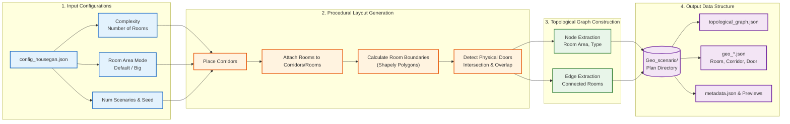

# Framework Design for AI Surrogate Model

กรอบแนวคิดนี้ถูกออกแบบมาให้เห็นภาพรวมของงานวิจัย ซึ่งสอดคล้องกับ Code Development และข้อเสนอที่เขียนใน Document คุณสามารถนำโค้ดด้านล่างไปใส่ในเครื่องมือที่รองรับ Mermaid (เช่น Notion, GitHub, หรือ Mermaid Live Editor) เพื่อแสดงแผนภาพ (Flowchart) ได้ทันที

