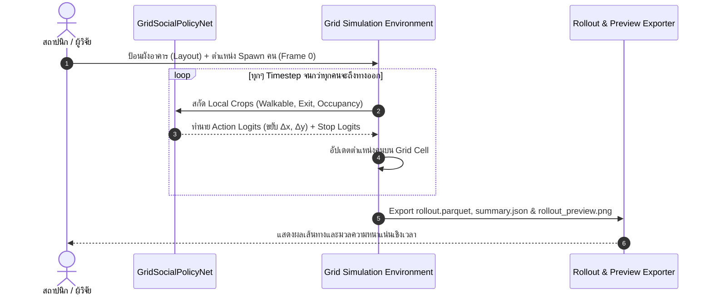

# Framework Diagrams: Time-Series AI Surrogate Pedestrian Simulation

เอกสารนี้รวบรวม Mermaid Diagrams อธิบาย Pipeline การทำงานและสถาปัตยกรรมเปรียบเทียบในงานวิจัย Time-Series AI Surrogate Model

---

## 1. ภาพรวม Research Framework Pipeline

```mermaid
flowchart TD
    subgraph DataGeneration ["1. Data Generation & Preprocessing"]
        A[Procedural Floorplans<br/>HouseGAN / Geo Scenarios] --> B[Physics-based Simulation<br/>JuPedSim / Social Force]
        B --> C[(SQLite Simulation Logs)]
        C --> D[Formatters<br/>Parquet & Grid Data Formatters]
    end

    subgraph ModelingParadigms ["2. AI Modeling Paradigms"]
        D --> E1[Continuous Coordinate Paradigm<br/>(x, y) Floating Point Regression]
        D --> E2[Discrete Grid Action Policy Paradigm<br/>Behavior-Cloning Discrete Action]

        E1 --> F1[Transformer GPT-2 / GNN-CVAE / SGAN]
        E2 --> F2[GridSocialPolicyNet CNN+MLP]
    end

    subgraph Evaluation ["3. Spatial Validity & Research Findings"]
        F1 --> G1[Continuous Trajectory Rollout]
        F2 --> G2[Discrete Grid Step Rollout]

        G1 --> H1[Spatial Feature Ignorance<br/>High Boundary Violation / Wall Clipping]
        G2 --> H2[High Spatial Awareness<br/>Wall Respect & Bottleneck Congestion]

        H1 --> I[Paper Findings & Comparative Analysis]
        H2 --> I
    end
```

---

## 2. การเปรียบเทียบสถาปัตยกรรมระหว่าง Continuous vs Discrete Grid

```mermaid
graph LR
    subgraph ContinuousModel ["Continuous Coordinate Model (Transformer/GNN)"]
        C_In1[Observed Positions (x,y)] --> C_Enc[Encoder / GPT-2]
        C_In2[Global Geo Mask] --> C_Enc
        C_Enc --> C_Out[Predict Next (x, y) Float Coordinates]
        C_Out -. Failure Mode .-> C_Err[Smooth Interpolation / Wall Clipping]
    end

    subgraph GridPolicyModel ["Discrete Grid Action Policy (GridSocialPolicyNet)"]
        G_In1[Local Walkable Grid Crop] --> G_CNN[CNN Map Encoder]
        G_In2[Local Exit Grid Crop] --> G_CNN
        G_In3[Local Occupancy Crop] --> G_CNN
        G_In4[Agent Scalar Features] --> G_MLP[MLP Encoder]

        G_CNN & G_MLP --> G_Fuse[Feature Fusion Layer]
        G_Fuse --> G_Out1[Action Logits Δx, Δy]
        G_Fuse --> G_Out2[Stop Logits]
        G_Out1 & G_Out2 -. Success Mode .-> G_Succ[Wall Respect & Flow Congestion Awareness]
    end
```

---

## 3. Workflow การทดสอบและการรัน Rollout


